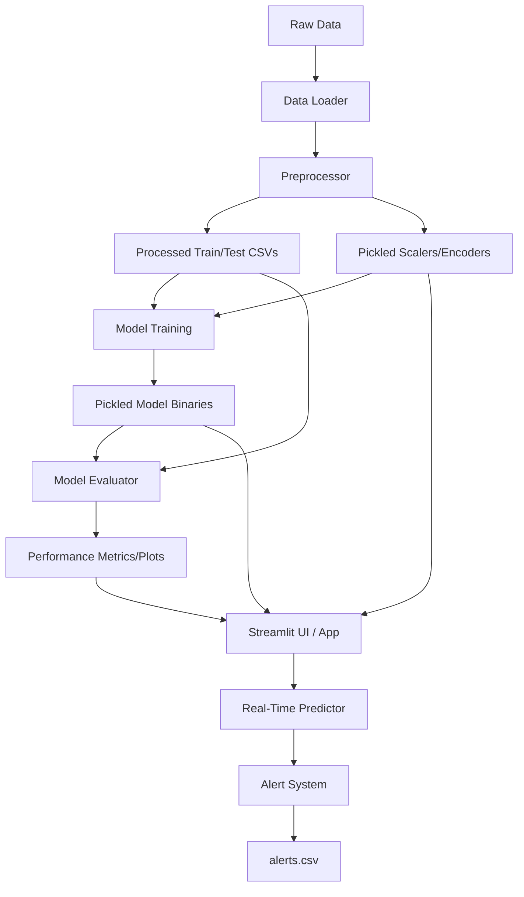

# ShieldNet AI: Network Anomaly Detection System (UNSW-NB15)

[](https://www.python.org/)
[](https://streamlit.io/)
[](https://pytorch.org/)
[](https://scikit-learn.org/)
[](#license)

ShieldNet AI is a modular, production-grade network intrusion and anomaly detection system. Built using **Python, PyTorch, Scikit-Learn, and Streamlit**, it applies multiple unsupervised machine learning paradigms to classify network traffic flows from the UNSW-NB15 benchmark dataset, identify potential security breaches, and log real-time threat alerts.

The system is designed for both batch-based testing/evaluation and interactive dashboard monitoring, ensuring network administrators and security analysts can inspect flow distributions, compare model performances, run ad-hoc inferences, and track incidents.

---

## 📁 Folder Structure

The project directory structure is laid out as follows:

```text
network-anomaly-detection/
├── app.py                          # Streamlit interactive dashboard web application
├── alerts.csv                      # Main security alerts database (persisted on disk)
├── sample_test.csv                 # Mixed 10-row clean/attack flow file for verification
├── requirements.txt                # Python package dependencies
├── README.md                       # High-level overview and execution guide (This file)
├── data/                           # Data storage directory
│   ├── raw/                        # Original UNSW-NB15 raw datasets and features schema
│   │   ├── NUSW-NB15_features.csv
│   │   ├── UNSW_NB15_testing-set.csv
│   │   └── UNSW_NB15_training-set.csv
│   ├── processed/                  # Transformed, cleaned, and scaled datasets
│   │   ├── test_processed.csv
│   │   └── train_processed.csv
│   └── output/                     # Empty output placeholder directory
├── models/                         # Serialized scalers, encoders, and model weights
│   ├── autoencoder.keras           # PyTorch deep autoencoder checkpoint (state dictionary)
│   ├── autoencoder_meta.json       # Autoencoder reconstruction error stats & threshold metadata
│   ├── encoders.pkl                # Custom label encoders for nominal features
│   ├── isolation_forest.pkl        # Serialized Isolation Forest estimator
│   ├── lof.pkl                     # Serialized Local Outlier Factor estimator
│   ├── one_class_svm.pkl           # Serialized One-Class SVM estimator
│   ├── preprocessing_config.pkl    # Preprocessing feature mapping configurations
│   └── scaler.pkl                  # Serialized StandardScaler estimator
├── reports/                        # Documentation, summaries, and static figures
│   ├── User_Guide.md               # User guide for running pipeline scripts
│   ├── data_overview.txt           # Dimensions, duplicates, and missing values report
│   ├── project_summary.md          # Early high-level project summary
│   ├── testing_report.md           # Markdown verification checklist generated by test suite
│   ├── final_results.md            # Overall project execution and pipeline design
│   ├── final_metrics_summary.md    # comparative analysis of evaluation metrics
│   ├── project_inventory.md        # Comprehensive directory mapping of project assets
│   ├── final_conclusion.md         # Summary of conclusions and system scope
│   ├── quality_report.md           # Code quality assessment and future debt
│   ├── figures/                    # Pre-rendered Exploratory Data Analysis (EDA) charts
│   │   ├── attack_distribution.png
│   │   ├── boxplots.png
│   │   ├── correlation_heatmap.png
│   │   ├── feature_scatter.png
│   │   ├── label_distribution.png
│   │   ├── numerical_histograms.png
│   │   ├── protocol_distribution.png
│   │   └── service_distribution.png
│   ├── metrics/                    # Core evaluation comparison reports and charts
│   │   ├── metrics_comparison.csv
│   │   ├── confusion_matrix.png
│   │   └── roc_curve.png
│   └── performance/                # Extended publication-quality performance reports and charts
│       ├── accuracy_comparison.png
│       ├── best_model_analysis.md
│       ├── combined_metrics_comparison.png
│       ├── confusion_matrix_comparison.png
│       ├── confusion_matrix_report.md
│       ├── f1_score_comparison.png
│       ├── feature_importance.png
│       ├── feature_importance_report.md
│       ├── model_comparison_table.png
│       ├── model_performance_ranking.png
│       ├── model_ranking.png
│       ├── performance_summary.csv
│       ├── performance_testing_report.md
│       ├── precision_comparison.png
│       ├── project_submission_checklist.md
│       ├── recall_comparison.png
│       ├── roc_curve_comparison.png
│       ├── roc_curve_report.md
│       └── shap_summary_plot.png
├── screenshots/                    # Streamlit dashboard screen captures
│   ├── alerts_page.png
│   ├── dashboard_homepage.png
│   ├── eda_page.png
│   ├── model_comparison_page.png
│   └── prediction_page.png
├── src/                            # Source code modules
│   ├── __init__.py
│   ├── preprocessing/              # Data loading, cleaning, and custom encoding
│   │   ├── __init__.py
│   │   ├── data_loader.py
│   │   ├── encoders.py
│   │   └── preprocessing.py
│   ├── models/                     # Model definitions and trainers
│   │   ├── autoencoder_model.py
│   │   ├── isolation_forest_model.py
│   │   ├── lof_model.py
│   │   └── one_class_svm_model.py
│   ├── visualization/              # EDA plotting script
│   │   └── eda.py
│   ├── evaluation/                 # Model evaluation and comparison reports
│   │   ├── evaluate_models.py
│   │   └── generate_performance_reports.py
│   └── utils/                      # Inferences, logging, and retraining pipelines
│       ├── alert_system.py
│       ├── predict.py
│       └── retrain_model.py
└── tests/                          # Automated unit test suite
    └── run_tests.py
```

---

## 🛡️ Features

### Implemented Capabilities
- **Four Machine Learning Paradigms**: Integrates tree-based (Isolation Forest), density-based (Local Outlier Factor), distance-based (One-Class SVM), and deep reconstruction-based (PyTorch Autoencoder) models.
- **Robust Preprocessing Pipeline**: Automatically handles missing values (by filling nominal attributes with `'unknown'` and numeric attributes with median values) and scaling (using a `StandardScaler`).
- **Graceful Unseen Category Handling**: Uses a custom `RobustLabelEncoder` for categorical inputs (`proto`, `service`, `state`) that routes unseen values at inference time to an `'unknown'` bin rather than raising key errors.
- **Real-Time Inference Engine**: Exposes a unified `AnomalyPredictor` class capable of taking arbitrary CSV data frames, running alignment/scaling, generating model-specific anomaly scores, and categorizing threats.
- **Dynamic Severity Alerts**: Implements a distance-from-boundary scoring metric inside `AlertSystem` that maps detected anomalies into **Low**, **Medium**, **High**, or **Critical** severity ratings.
- **Interactive Security Operations Dashboard**: A multi-page Streamlit application enabling users to inspect high-level KPIs, generate interactive Plotly visualizations, trigger ad-hoc CSV predictions, and review incident alert history.
- **Log Management and Export**: Automatically persists detected anomalies to `alerts.csv` with core connection contexts and provides dashboard options to download predictions or clear logs.
- **Comprehensive Retraining Orchestrator**: Script to automate the end-to-end data reload, feature engineering update, multi-model retraining, and performance evaluation reports using a single script.
- **Validation Suite**: Unittest module verifying the loader, preprocessor, model loading state, and real-time predictor.

### System Limitations
- **Offline Batch Operations**: The system is designed to consume pre-calculated packet connection flows (CSVs) matching the UNSW-NB15 feature schema; it does not feature direct network card sniffing (like PCAP packet capturing).
- **Scale and Memory Restrictions**: Distance-based models (One-Class SVM and LOF) scale poorly on millions of data records. LOF, in particular, requires the training dataset to be kept in memory for out-of-sample novelty calculations. To mitigate OOM crashes and high prediction latency, training for LOF and One-Class SVM utilizes a subsampling limit (default 5,000 samples).
- **Single-Threaded Execution**: The current prediction pipeline runs on a single CPU thread, which may bottleneck throughput under high-frequency streaming workloads.

---

## 🏗️ Architecture

ShieldNet AI utilizes a decoupled pipeline architecture split into discrete operational stages:



### Module Responsibilities

1. **Preprocessing (`src/preprocessing/`)**:
   - `data_loader.py`: Handles file loading, checks dimension consistency, and saves a text report (`reports/data_overview.txt`).
   - `encoders.py`: Defines the `RobustLabelEncoder` class which handles new/unseen labels gracefully by mapping them to `unknown`.
   - `preprocessing.py`: Cleans missing values, drops duplicates (train set only), encodes categoricals, fits/applies `StandardScaler` to numerical inputs, and serializes transformation assets.

2. **Model Classifiers (`src/models/`)**:
   - `isolation_forest_model.py`: Fits and serializes `IsolationForest` using a capped dataset contamination rate (`contamination = min(0.49, mean_anomaly_ratio)`).
   - `lof_model.py`: Fits and serializes a novelty-based `LocalOutlierFactor` estimator on normal traffic (`label == 0`).
   - `one_class_svm.pkl`: Fits and serializes an RBF-kernel `OneClassSVM` model on normal traffic.
   - `autoencoder_model.py`: Implements and trains the deep bottleneck network using PyTorch on normal traffic. It saves weights to `autoencoder.keras` and evaluates the 95th percentile of normal reconstruction MSE to establish the anomaly threshold.

3. **Evaluation and Reporting (`src/evaluation/`)**:
   - `evaluate_models.py`: Scores test datasets, outputs classification metrics, and generates confusion matrices (`confusion_matrix.png`) and ROC curve overlays (`roc_curve.png`).
   - `generate_performance_reports.py`: Generates metric bar charts, model ranking plots, permutation feature importance reports, and SHAP explainability summaries.

4. **Runtime Pipeline (`src/utils/`)**:
   - `alert_system.py`: Classifies warning levels (Low, Medium, High, Critical) based on how far anomaly scores deviate from model thresholds. Writes detected threats to the local `alerts.csv` log.
   - `predict.py`: Provides the production `AnomalyPredictor` class wrapper which preprocesses raw input CSVs, executes predictions, and triggers alerts.
   - `retrain_model.py`: Orchestrates a full system update by chain-executing the preprocessing, model training, and evaluation scripts.

---

## 🛠️ Tech Stack

- **Programming Language**: Python (verified on 3.10 through 3.14.5)
- **Machine Learning**: Scikit-Learn, PyTorch (Deep Learning Engine), Joblib
- **Data Manipulation**: Pandas, NumPy
- **Interactive UI**: Streamlit
- **Visualizations**: Plotly, Seaborn, Matplotlib, SHAP (model explainability)
- **Testing**: Python standard library `unittest`

---

## 🚀 Installation

### Prerequisites
- **Python**: Version 3.10 to 3.14
- **Operating System**: Windows, macOS, or Linux

### Step-by-Step Setup

1. **Navigate to the Project Directory**:
   Open a terminal and go to the root workspace directory:
   ```bash
   cd d:\network-anomaly-detection
   ```

2. **Create a Virtual Environment**:
   Initialize a localized virtual environment (named `.venv`):
   ```bash
   python -m venv .venv
   ```

3. **Activate the Virtual Environment**:
   - **Windows (PowerShell)**:
     ```powershell
     .venv\Scripts\Activate.ps1
     ```
   - **Windows (CMD)**:
     ```cmd
     .venv\Scripts\activate.bat
     ```
   - **Linux / macOS**:
     ```bash
     source .venv/bin/activate
     ```

4. **Install Dependencies**:
   Install all library packages listed in the requirements file:
   ```bash
   pip install -r requirements.txt
   ```

---

## ⚙️ Configuration

The system is configured through local metadata configurations and serialized estimators stored inside the `models/` directory:

- **`models/autoencoder_meta.json`**:
  Contains parameters for the trained PyTorch Autoencoder, dynamically loaded at inference time:
  ```json
  {
      "input_dim": 42,
      "threshold": 0.17126791179180145,
      "mean_error": 0.061202406883239746,
      "std_error": 0.2214616984128952
  }
  ```
- **`models/preprocessing_config.pkl`**:
  Stores categorical features, numerical features, and excluded feature lists generated during preprocessor fitting.
- **`models/scaler.pkl`**:
  Fitted `StandardScaler` used to normalize numerical metrics during prediction.
- **`models/encoders.pkl`**:
  A dictionary of custom `RobustLabelEncoder` instances for categorical columns `proto`, `service`, and `state`.

---

## 💻 Usage

### Starting the Streamlit Dashboard
Launch the interactive web console:
```bash
streamlit run app.py
```
After executing, the dashboard will launch at `http://localhost:8501`.

### Step-by-Step Pipeline Execution
You can run individual pipeline modules independently from the root directory:

1. **Analyze and Load Raw Data**:
   ```bash
   python src/preprocessing/data_loader.py
   ```
2. **Preprocess and Save Datasets**:
   ```bash
   python src/preprocessing/preprocessing.py
   ```
3. **Generate EDA Visuals**:
   ```bash
   python src/visualization/eda.py
   ```
4. **Train ML Models**:
   ```bash
   python src/models/isolation_forest_model.py
   python src/models/lof_model.py
   python src/models/one_class_svm_model.py
   python src/models/autoencoder_model.py
   ```
5. **Evaluate Models on the Test Set**:
   ```bash
   python src/evaluation/evaluate_models.py
   ```
6. **Generate Performance Visualizations and Reports**:
   ```bash
   python src/evaluation/generate_performance_reports.py
   ```

### Orchestrating System Retraining
If a new set of raw datasets is placed in the `data/raw/` folder, trigger a complete preprocessing, retraining, and evaluation loop using:
```bash
python src/utils/retrain_model.py
```

---

## 📖 API Documentation

The project exposes a programmatic Python API via the `AnomalyPredictor` class.

### `AnomalyPredictor` Class
Found in [predict.py](file:///d:/network-anomaly-detection/src/utils/predict.py).

#### Constructor
```python
AnomalyPredictor(models_dir: Path = Path("models"))
```
Loads all preprocessing config dictionary, fitted scaler, RobustLabelEncoders dictionary, and sets up connection to the `AlertSystem`.

#### Methods

##### `preprocess_input(df: pd.DataFrame) -> Tuple[pd.DataFrame, pd.DataFrame]`
Transforms a raw input dataset matching the UNSW-NB15 schema.
- **Arguments**:
  - `df`: Pandas DataFrame containing raw network connection metrics.
- **Returns**:
  - `Tuple[raw_display_df, transformed_df]`:
    - `raw_display_df`: A copy of the input DataFrame with NaN values filled and placeholder characters removed.
    - `transformed_df`: The fully scaled, encoded, and column-ordered DataFrame ready for model input.

##### `predict(df_input: pd.DataFrame, model_name: str) -> pd.DataFrame`
Executes end-to-end anomaly prediction and severity classification.
- **Arguments**:
  - `df_input`: Pandas DataFrame of raw network traffic.
  - `model_name`: String name of the model to use (`"Autoencoder"`, `"Local Outlier Factor"`, `"One-Class SVM"`, `"Isolation Forest"`).
- **Returns**:
  - `result_df`: A copy of the input DataFrame appended with:
    - `Prediction`: binary class (`0` for clean/normal, `1` for anomalous).
    - `Anomaly_Score`: raw model scoring metric (e.g. reconstruction error for Autoencoder, negative decision values for others).
    - `Severity`: calculated threat level (`"Low"`, `"Medium"`, `"High"`, `"Critical"`).
- **Side-Effects**:
  - Appends details of any detected anomalies (`Prediction == 1`) to `alerts.csv`.

---

## 📊 Results Summary

Performance evaluated on the UNSW-NB15 testing partition (82,332 records containing 44.94% normal and 55.06% attack distributions):

| Model | Accuracy | Precision | Recall | F1-Score | Detection Characteristic |
| :--- | :---: | :---: | :---: | :---: | :--- |
| **Local Outlier Factor (LOF)** | **80.64%** | **92.12%** | **70.91%** | **80.14%** | Balanced, high precision with strong recall |
| **PyTorch Autoencoder** | **69.26%** | **86.44%** | **52.39%** | **65.24%** | Robust representation, low false alerts |
| **One-Class SVM** | **63.17%** | **90.29%** | **37.11%** | **52.60%** | Highly conservative, high precision / low recall |
| **Isolation Forest** | **36.88%** | **42.20%** | **39.60%** | **40.86%** | Poor performance under baseline settings |

> [!NOTE]
> The performance metrics listed above are the actual calculated results stored in `reports/metrics/metrics_comparison.csv`. The hardcoded fallback metrics defined in `app.py` (which are used only if CSV files are missing) differ slightly for the Autoencoder model.

---

## 💡 Examples

### Programmatic Python Usage Example

The following script shows how to load raw logs, instantiate `AnomalyPredictor`, run prediction using the PyTorch Autoencoder model, and display results:

```python
import pandas as pd
from pathlib import Path
from src.utils.predict import AnomalyPredictor

def run_custom_inference():
    # 1. Load sample network flows
    sample_df = pd.read_csv("sample_test.csv")
    print(f"Loaded {len(sample_df)} flows to test.")
    
    # 2. Instantiate Predictor
    predictor = AnomalyPredictor(models_dir=Path("models"))
    
    # 3. Predict anomalies using the PyTorch Autoencoder
    predictions = predictor.predict(sample_df, model_name="Autoencoder")
    
    # 4. View results
    output_cols = ["proto", "service", "state", "Prediction", "Anomaly_Score", "Severity"]
    print("\n=== Inference Results ===")
    print(predictions[output_cols])

if __name__ == "__main__":
    run_custom_inference()
```

---

## 🧪 Testing

The codebase includes an automated unit test suite inside the `tests/` directory:

- **Running Tests**:
  Verify the system loader, preprocessor, serialized models, predictions, and alerts:
  ```bash
  python tests/run_tests.py
  ```
- **Validation Checklist**:
  The suite runs 5 core unit tests:
  1. `test_data_loader`: Validates data structures and file dimensions.
  2. `test_preprocessing`: Verifies duplicate cleaning, categorical mappings, and scaling.
  3. `test_model_loading`: Tests deserialization and loading checks for all four estimators.
  4. `test_predict_pipeline`: Validates formatting outputs (Prediction, Anomaly_Score, Severity).
  5. `test_alert_system`: Tests warning evaluations and appends logs to mock files.

- **Coverage Information**: `Needs Manual Input` (Test coverage is not currently tracked by any configuration or package in the repository).

---

## 🚢 Deployment

- **Streamlit Local Server**: The project is optimized to run locally via `streamlit run app.py` for evaluation.
- **Streamlit Community Cloud / Server Deployment**:
  Connect a GitHub repository containing this codebase, setting `app.py` as the entrypoint. The virtual environment automatically reads the `requirements.txt` file.
- **Containerization (Docker)**: `Needs Manual Input` (There are no Dockerfiles or docker-compose configurations implemented in this repository).

---

## 🔍 Troubleshooting

### 1. Scikit-Learn `UserWarning: X does not have valid feature names`
- **Cause**: Scikit-Learn models (specifically Local Outlier Factor) were fitted on a pandas DataFrame containing feature names, but evaluate/prediction pipelines pass data matrices inside generic numpy shapes.
- **Fix**: This warning is informational and does not impact classification accuracy. The console output has been suppressed, and pandas columns are preserved in the predict wrapper to prevent alignment issues.

### 2. File Checkpoint `autoencoder.keras`
- **Cause**: Despite its `.keras` extension, this file contains a PyTorch state dictionary checkpoint.
- **Fix**: Do not load this file using Keras/TensorFlow. The code is hardcoded to load the file using PyTorch's native `torch.load` loader, which is fully compatible with CPU and GPU runtimes.

### 3. Out of Memory (OOM) Crashes during LOF / One-Class SVM training
- **Cause**: Fitting LOF or One-Class SVM on the complete training partition (>170k flows) requires high memory footprint due to density-based distance calculations.
- **Fix**: The trainers limit training sizes to a default sample limit of 5,000 records. If you experience performance degradation or memory constraints on lower-spec servers, reduce the sample size in `lof_model.py` and `one_class_svm_model.py`.

---

## 🤝 Contributing

`Needs Manual Input` (No contributor guidelines, code of conduct, or pull request templates are currently included in the repository).

---

## 📄 License

`Needs Manual Input` (No LICENSE file or license metadata has been detected in this project repository).
